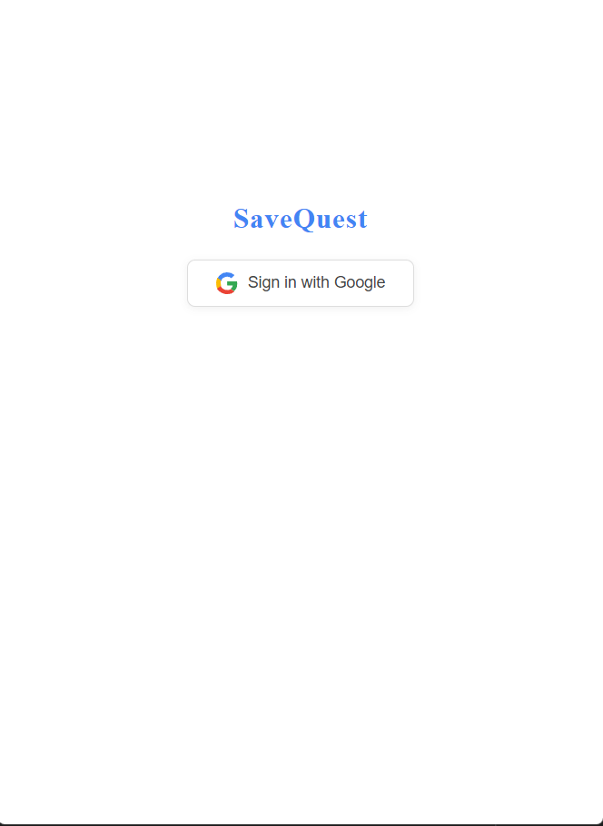
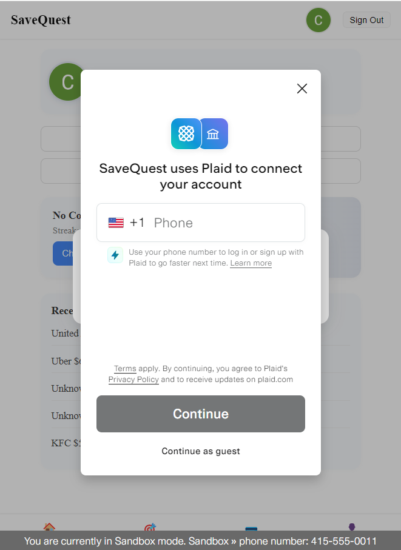

# SaveQuest

**SaveQuest is built on a modern, cloud-native architecture: React frontend, Node.js backend, Firestore database, and Plaid for secure bank integration.**

---

## Demo Screen Shorts
## Sign in page

**Demo: Sign in flow and onboarding**  
[](https://www.youtube.com/watch?v=5rEMXYsry88)

### Dashboard


### Dashboard - Join a challenge

**Demo: How to join a savings challenge**  
[](https://www.youtube.com/watch?v=krRlft0J9kw)


### Dashboard - Connect To Bank

**Demo: Connecting your bank account with Plaid**  
[](https://www.youtube.com/watch?v=1K0OC13wAYs)


### Dashboard - Sync Transactions and View Transaction History

**Demo: Syncing transactions and viewing your history**  
[](https://www.youtube.com/watch?v=wHFxBnb3TMc)


### Dashboard - Join Challenges

**Demo: Joining multiple challenges**  
[](https://www.youtube.com/watch?v=zWXF6tLMlqw)

### Dashboard - View Challenges and check-in

**Demo: Viewing challenges and daily check-in**  
[](https://www.youtube.com/watch?v=lAmVcFTXeo0)
### Challenges View


**Demo: Viewing all available challenges**  
[](https://www.youtube.com/watch?v=hlEwe3imidM)


## 🛠️ Technical Overview

- **Frontend:** React (Vite or Next.js), Tailwind CSS, Framer Motion, Plaid Link JS, hosted on Vercel
- **Backend:** Node.js (Express.js), Plaid Node.js SDK, Firebase Admin SDK, REST API, hosted on Render/Railway/Cloud Run
- **Database:** Firestore (Firebase, NoSQL)
- **Notifications:** Firebase Cloud Messaging (FCM)
- **Bank Integration:** Plaid API

---

## 🗂️ Architecture Diagram

Here’s a **textual diagram** you can drop into any drawing tool:

```
+----------------------------------------------------+
|                    Frontend App                    |
|         (React Web App or React Native)            |
|                                                    |
| - User Login/Signup                                |
| - Plaid Link widget                                |
| - Dashboard showing challenges & streaks           |
| - Confetti & animations                            |
| - Leaderboards                                     |
| - Calls API endpoints                              |
+----------------------------+-----------------------+
               |
       HTTPS calls (REST APIs, JSON payloads)
               |
+----------------------------v-----------------------+
|                   Backend API (Node.js)            |
|                  (Express.js or Fastify)           |
|                                                    |
| - User auth logic                                  |
| - Plaid token exchange                             |
| - Fetch transactions                               |
| - Detect merchants (e.g. Starbucks)                |
| - Challenge engine: streaks, XP, bonuses           |
| - Handle Plaid webhooks                            |
| - Communicate with Firestore                       |
+----------------------------+-----------------------+
               |
         Firestore SDK / REST calls
               |
+----------------------------v-----------------------+
|                     Firestore DB                   |
|                  (Firebase, NoSQL)                 |
|                                                    |
| - Users collection                                 |
| - Challenges collection                            |
| - UserChallenges collection                        |
| - Savings pots                                     |
| - Analytics metrics                                |
+----------------------------+-----------------------+
               |
       External API integrations and services
               |
+----------------------------v-----------------------+
|                       Plaid API                    |
|                                                    |
| - User bank linking                                |
| - Fetch transactions from banks                    |
| - Categories & merchant data                       |
| - Webhooks for new transactions                    |
+----------------------------------------------------+

+----------------------------------------------------+
|               Notifications Service                |
|             (Firebase Cloud Messaging)             |
|                                                    |
| - Daily reminders                                  |
| - Streak updates                                   |
| - Completion notifications                         |
+----------------------------------------------------+
```

---

## 🔄 How Data Flows

- User opens SaveQuest frontend
- Clicks **Connect Bank** → triggers Plaid Link
- Plaid returns a `public_token` → sent to backend
- Backend exchanges token for permanent access token, fetches transactions, analyzes merchant/category, updates Firestore (challenges, streaks, savings)
- Frontend reads data from backend API, animates progress, displays leaderboards
- Notifications sent via Firebase Cloud Messaging

---

## 📦 Database Layer

Firestore collections:

```
users
  - userId
    email
    totalSavings
    XP

challenges
  - challengeId
    name
    rules
    dailyPledge

userChallenges
  - composite key (userId_challengeId)
    streak
    status

transactions
  - txnId
    userId
    merchantName
    amount
    category
```

---

## 💸 Estimated Dev Stack Costs (MVP)

| Service            | Cost                                   |
| ------------------ | -------------------------------------- |
| Vercel free tier   | \$0                                    |
| Render free tier   | \$0                                    |
| Firebase free tier | \$0 (within limits)                    |
| Plaid sandbox      | \$0                                    |
| Plaid production   | \~\$500/mo starting (depends on usage) |

✅ **So your MVP can run for free, except Plaid fees once you go live.**

---

## ⭐ Why This Architecture Rocks

✅ Node.js backend = lightweight & fast  
✅ Frontend + backend both JavaScript = same language stack  
✅ Firestore = serverless, scalable, real-time  
✅ Plaid = secure bank data integration  
✅ Cloud hosting = cheap or free for MVP

---

## 🚀 Features & User Experience

- Pick savings challenges (e.g. “No Starbucks Week”)
- Set your own pledge amount
- Connect your bank securely via Plaid
- Automatic tracking of spending and streaks
- Earn rewards, XP, and bonuses for success
- Visual dashboard with progress, leaderboards, and confetti

---

## 🎯 Why SaveQuest?

Most people want to save money, but find it boring or hard. SaveQuest makes saving exciting by turning it into a game — with challenges, streaks, and rewards — so you build good habits and reach your goals faster.

---

## How SaveQuest Works

1. **Pick a Challenge**
   - e.g. “No Starbucks Week”, “No Uber rides for 10 days”, “Spend \$0 this weekend”
2. **Set Your Pledge**
   - Decide how much to save each time you succeed (e.g. “I’ll save \$5 every day I skip Starbucks.”)
3. **Connect Your Bank Account**
   - Securely link your bank using Plaid; SaveQuest reads your real transactions (with permission).
4. **Track Your Spending Automatically**
   - Each day, SaveQuest checks your transactions:
   - If you didn’t spend at the challenge merchant → streak goes up!
   - If you did spend → streak resets.
5. **Get Rewarded**
   - Complete a challenge to move your pledged savings into your “savings pot”, earn XP, and spin a bonus wheel.
6. **See Your Progress**
   - Dashboard shows total saved, current streaks, XP level, and leaderboards.

---

**TL;DR:**  
SaveQuest uses real bank data to check if you kept your spending promises, and turns saving money into a fun, gamified experience.

---

# ✅ **What SaveQuest Does NOT Do**

❌ It **doesn’t directly move your money** between banks (for now).  
❌ It **doesn’t invest your money.**  
❌ It **never takes money without your permission.**

---

# ✅ **Plaid Integration**

* Plaid Link widget launches in frontend
* Frontend sends `public_token` → backend
* Backend exchanges token → stores Plaid `access_token`
* Periodic fetch of transactions
* Webhooks for:
  * New transactions
  * Errors

---

# ✅ **Notifications Layer**

* Firebase Cloud Messaging sends:
  * “Don’t forget today’s challenge!”
  * “You finished No Starbucks Week! 🎉”

---

# ✅ **Hosting Overview**

| Layer         | Hosting                       |
| ------------- | ----------------------------- |
| Frontend      | Vercel                        |
| Backend       | Render, Railway, or Cloud Run |
| Firestore     | Firebase (GCP-managed)        |
| Plaid API     | Hosted by Plaid               |
| Notifications | Firebase Cloud Messaging      |

---

## ✅ **Scalability Plan**

* Backend → stateless → horizontal scaling
* Firestore auto-scales
* Plaid handles millions of transactions
* Frontend → globally distributed via Vercel

---

**TL;DR:**  
→ SaveQuest uses React frontend + Node.js backend + Firestore DB + Plaid.  
→ Everything fits in a modern, cloud-native architecture ready for MVP and scale.


